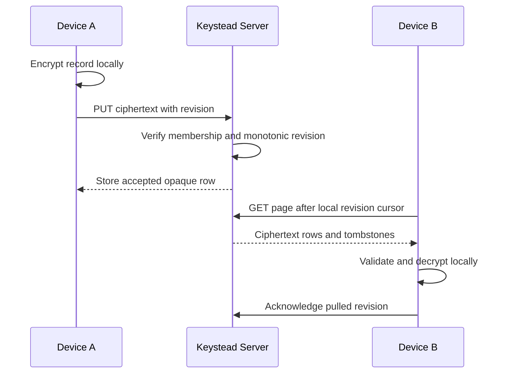

# Keystead Server

Keystead Server is the self-hosted synchronization and account service for
Keystead. It lets a person use the same encrypted vault across verified devices
and share a vault with other users without giving the server the ability to
decrypt secret contents.

The desktop client performs encryption and decryption. The server authenticates
requests, enforces ownership and roles, stores opaque encrypted rows, orders
sync revisions, distributes client-wrapped vault keys, and records redacted
security events.

Keystead Core and Keystead Client are independent repositories. You can inspect
or deploy the server on its own, but it becomes useful as a password-manager
system when paired with a compatible client.

## What the server gives you

- User registration and short-lived bearer sessions.
- Hashed, revocable refresh tokens and account-wide logout.
- Verified-device enrollment using a challenge and signed proof.
- Device-bound sessions that stop working after device revocation.
- Encrypted vault and record synchronization with pagination and tombstones.
- Revision-conflict responses instead of silent last-write-wins replacement.
- Recipient-scoped wrapped vault-key packages.
- Vault roles for owners, administrators, editors, and viewers.
- Key-generation rotation records that prevent publication under a stale key
  generation.
- Scoped automation principals that can read ciphertext without receiving
  plaintext or a raw vault key.
- Append-only, redacted audit events stored through JPA.

## How it protects your vault

The zero-knowledge boundary is architectural: the API has no endpoint for
uploading a raw vault key or plaintext secret.

| The server can see | The server must not see |
| --- | --- |
| Account and device identifiers | Plaintext passwords, notes, tokens, or private keys |
| Vault IDs, revisions, timestamps, roles | Raw vault keys |
| Secret type protocol values | Device private keys |
| Ciphertext sizes and synchronization activity | Decrypted record metadata or payloads |
| Public proof/wrapping keys | Passwords or tokens inside audit events |
| Opaque encrypted profiles and envelopes | Wrapped-key ciphertext inside audit details |

This is not anonymity. An operator can observe accounts, device and vault
relationships, membership, timing, revision activity, and ciphertext sizes.
The privacy claim is that the server cannot decrypt vault contents using the
data it stores.

Persistence is JPA-only at the application boundary. Flyway owns the schema;
Hibernate schema generation is disabled. Database constraints mirror model
invariants for revisions, row shapes, key packages, refresh tokens, devices,
memberships, cursors, and append-only audit rows.

## How synchronization works



Revisions are monotonic within a vault and indexed for deterministic paging. A
delete is stored as a tombstone without encrypted profile or payload fields.
The server retains tombstones; automatic compaction is intentionally disabled
because safe deletion requires conservative evidence that every active device
has advanced past the deletion.

If two writers race, database uniqueness and service checks translate the
losing write into the same redacted revision-conflict response. The server does
not attempt to merge decrypted fields because it cannot read them.

## Accounts, devices, and sharing

### Sessions

`POST /api/v1/auth/login` exchanges a username and password for a 15-minute
access token and a longer-lived opaque refresh token. Refresh tokens are stored
as hashes and can be revoked individually. `logout-all` revokes outstanding
refresh tokens and increments a durable account token version so earlier access
tokens fail immediately.

Production configuration disables HTTP Basic authentication by default. It can
be enabled explicitly for local compatibility testing, but normal clients use
bearer tokens and clear the password after login.

### Verified devices

A device registers separate public material for proof and vault-key wrapping.
It must sign a short-lived server challenge before it becomes eligible for
device-bound sessions or wrapped vault-key packages. Revocation blocks both
existing device-bound access tokens and future refreshes.

### Sharing

Membership is whole-vault and role based. Owners and administrators manage
members; editors can write records; viewers can pull encrypted records. A
client wraps the vault key for each eligible recipient device. Removing a
member prevents future packages, but cannot erase ciphertext or plaintext that
the member already synchronized. Protecting future data requires client-side
key rotation and redistribution to the remaining devices.

## Deployment

Requires JDK 21.

### Local H2

```bash
./gradlew bootRun
```

The default profile stores an H2 database under `data/` and runs migrations at
startup. This is convenient for development and single-machine evaluation; it
is not the recommended database for a serious multi-user deployment.

### PostgreSQL with Docker

```bash
docker compose up -d
./gradlew bootRun --args='--spring.profiles.active=postgres'
```

The included Compose file starts PostgreSQL 17 on port 5432 with development
credentials. Change those credentials before exposing the service.

### Existing PostgreSQL

```bash
export KEYSTEAD_DB_URL='jdbc:postgresql://localhost:5432/keystead'
export KEYSTEAD_DB_USERNAME='keystead'
export KEYSTEAD_DB_PASSWORD='replace-this-value'
./gradlew bootRun --args='--spring.profiles.active=postgres'
```

PowerShell users can set the same names through `$env:KEYSTEAD_DB_URL`,
`$env:KEYSTEAD_DB_USERNAME`, and `$env:KEYSTEAD_DB_PASSWORD`.

## Configuration

| Setting | Default | Meaning |
| --- | --- | --- |
| `spring.profiles.active` | default H2 profile | Use `postgres` for PostgreSQL. |
| `KEYSTEAD_DB_URL` | local PostgreSQL URL in the profile | JDBC connection URL. |
| `KEYSTEAD_DB_USERNAME` | `keystead` | Database user. |
| `KEYSTEAD_DB_PASSWORD` | empty | Database password; set it outside development. |
| `keystead.security.basic-auth-enabled` | `false` | Enables compatibility Basic authentication. |

Spring Boot Actuator exposes health and info endpoints. Deployments should add
TLS termination, network controls, secret management, database backups, and
monitoring appropriate to their environment.

## Verification

```bash
./gradlew spotlessCheck test --no-daemon --rerun-tasks
```

The current complete suite contains 247 tests. It includes H2/Flyway database
constraints, JPA-only architecture checks, auth and device lifecycle tests,
sync races, membership roles, rotation, automation isolation, and audit
redaction sentinels.

## Current limitations

- The access-token HMAC key is generated at server startup. Restarting the
  process invalidates existing access tokens, and the current implementation is
  not suitable for active-active multi-node issuance without a durable shared
  signing-key design.
- There is no built-in TLS termination, email verification, password-reset
  service, passkey login, administrative console, or hosted recovery workflow.
- Automatic tombstone compaction is disabled.
- Sharing primitives are implemented, but removal cannot revoke data already
  copied by a former member.
- The project has extensive automated tests but no independent security audit
  or long-running public production record.
- H2 is for local use; PostgreSQL deployments still need operator-managed
  backups, upgrades, monitoring, and secrets.

Keystead Server is currently intended for technically capable self-hosters who
can operate its database, TLS boundary, backups, monitoring, and signing-key
lifecycle. It is not yet a turnkey production service.
