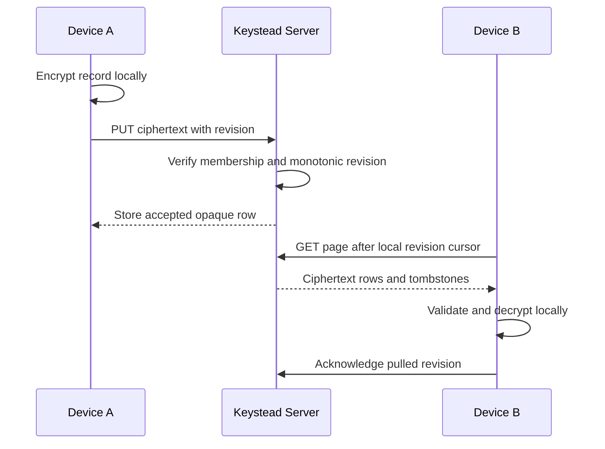

# Keystead Server

Keystead Server is the self-hosted coordination service for the Keystead
product family. It lets users synchronize an encrypted vault across verified
devices, share whole vaults with other accounts, coordinate vault-key rotation,
and recover account access — all without the server ever receiving a raw vault
key or plaintext secret.

The desktop client performs all encryption and decryption locally. The server
only authenticates requests, enforces ownership and roles, stores opaque
ciphertext rows, orders sync revisions, distributes vault-key packages that
clients wrapped for specific recipients, and records redacted security events.

## The Keystead ecosystem

Keystead is delivered as three independently versioned repositories:

| Project | What it provides |
| --- | --- |
| **[Keystead Server](https://github.com/MidCoard/keystead-server)** | This self-hosted coordination service, its REST API, JPA persistence model, and Flyway schema |
| **[Keystead Client](https://github.com/MidCoard/keystead-client)** | The desktop application that owns plaintext, local vaults, device private keys, OS-native secure storage, sync, collaboration, and recovery workflows |
| **[Keystead Core](https://github.com/MidCoard/keystead)** | The Java cryptography, typed-secret, encrypted-protocol, native-memory, persistence, recovery, and rotation foundation used by the client and server |

The server can be built, inspected, and deployed independently, but it only
becomes a usable secret-management system when paired with a compatible client.
OS-native protection is implemented where secrets actually exist: Core uses
locked native memory and exposes process hardening; the client integrates
Windows DPAPI, macOS Keychain, and Linux Secret Service. The server deliberately
never receives the private material those controls protect.

## What the server gives you

- User registration and short-lived bearer sessions.
- Hashed, revocable refresh tokens and account-wide logout.
- Verified-device enrollment using a challenge and a signed proof.
- Device-bound sessions that stop working after device revocation.
- Encrypted vault-record synchronization with pagination and tombstones.
- Revision-conflict responses instead of silent last-write-wins replacement.
- Recipient-scoped wrapped vault-key packages.
- Vault roles for owners, administrators, editors, and viewers.
- Invitations, acceptance, per-device package coverage, removal, and staged
  key rotation with restart-safe client resumption.
- Offline-kit and verified-device account recovery without giving the server
  access to a recovery private key or raw vault key.
- Scoped automation principals that can read ciphertext without receiving
  plaintext or a raw vault key.
- Append-only, redacted audit events stored through JPA.

## How it protects your vault

The zero-knowledge boundary is architectural: the API has no endpoint for
uploading a raw vault key or plaintext secret.

In Keystead, a vault is one `.kvault` file that uses **envelope encryption**:
a random 32-byte **data encryption key (DEK)** encrypts the vault contents, and
the DEK is wrapped by each unlock credential (passphrase, device key, or
recovery key). The server stores the encrypted vault metadata, encrypted
records, and wrapped key packages, but it never has the passphrase, device
private keys, or the DEK.

| The server can see | The server must not see |
| --- | --- |
| Account and device identifiers | Plaintext passwords, notes, tokens, or private keys |
| Vault fingerprints, revisions, timestamps, roles | Raw vault keys (the DEK) |
| Secret-type protocol values | Device private keys |
| Ciphertext sizes and synchronization activity | Decrypted record metadata or envelope contents |
| Public proof/wrapping keys | Passwords or tokens inside audit events |
| Opaque encrypted profiles and envelopes | Wrapped-key ciphertext inside audit details |

This is not anonymity. An operator can observe accounts, device and vault
relationships, membership, timing, revision activity, and ciphertext sizes.
The privacy claim is that the server cannot decrypt vault contents using only
the data it stores.

Persistence is JPA-only at the application boundary. Flyway owns the schema;
Hibernate schema generation is disabled. Database constraints mirror model
invariants for revisions, row shapes, key packages, refresh tokens, devices,
memberships, cursors, and append-only audit rows.

## How synchronization works


```mermaid
sequenceDiagram
    participant A as Device A
    participant S as Keystead Server
    participant B as Device B

    A->>A: Encrypt record locally
    A->>S: PUT ciphertext with revision
    S->>S: Verify membership and monotonic revision
    S-->>A: Store accepted opaque row
    B->>S: GET page after local revision cursor
    S-->>B: Ciphertext rows and tombstones
    B->>B: Validate and decrypt locally
    B->>S: Acknowledge pulled revision
```

Revisions are monotonic within a vault and indexed for deterministic paging. A
delete is stored as a **tombstone** — a row marked deleted with the encrypted
profile and envelope fields emptied. The server keeps tombstones so clients can
learn about deletions; automatic compaction is disabled because safe deletion
requires evidence that every active device has already advanced past the
tombstone's revision.

If two writers race, database uniqueness constraints and service checks turn
the losing write into the same redacted `409 Conflict` revision-conflict
response. The server does not attempt to merge decrypted fields because it
cannot read them. The client resolves the conflict by pulling the winning
revision and reapplying its change with a higher revision.

## Accounts, devices, and sharing

### Sessions

`POST /api/v1/auth/login` exchanges a username and password for a 15-minute
**access token** and a 30-day opaque **refresh token**. Refresh tokens are
stored as SHA-256 hashes and can be revoked individually. `POST
/api/v1/auth/logout-all` revokes all outstanding refresh tokens and increments
a durable account token version so earlier access tokens fail immediately.

Production configuration disables HTTP Basic authentication by default. It can
be enabled explicitly for local compatibility testing, but normal clients use
bearer tokens and clear the password after login.

### Verified devices

A device registers separate public material for proof and vault-key wrapping:

- The **proof key** is used to sign a short-lived server challenge.
- The **wrapping key** is a public key the client uses to wrap the vault DEK
  for that device.

The device must sign a server challenge before it becomes eligible for
device-bound sessions or wrapped vault-key packages. Device revocation blocks
both existing device-bound access tokens and future refreshes, removes the
device's vault-key packages, and marks affected vaults as needing key rotation.

### Sharing

Membership is whole-vault and role based. Owners and administrators manage
members; editors can write records; viewers can only pull encrypted records. A
client wraps the vault DEK for each eligible recipient device. Removing a
member prevents future packages, but it cannot erase ciphertext or plaintext
that the member already synchronized. Protecting future data requires
client-side key rotation and redistribution to the remaining devices.

The server makes that transition explicit:

- When an invitee accepts, the membership enters `ACCEPTED_PENDING_KEY`; the
  member cannot read or write until a manager uploads a current vault-key
  package for one of the member's verified devices.
- Removing an active member changes the vault state to `ROTATION_REQUIRED`,
  immediately rejects further writes, deletes the former member's packages, and
  excludes the member from the next rotation snapshot.

Only after the remaining members complete a staged rotation does the vault
return to `STABLE` and allow writes again.

### Single-secret share links

Beyond whole-vault membership, a client can share **one** secret as a
self-contained encrypted string (see Keystead Core's [README](https://github.com/MidCoard/keystead/blob/master/README.md#single-secret-sharing)). The
server hosts these opaque blobs behind short codes so a recipient can redeem
them without an account:

- `POST /api/v1/shares` (authenticated) stores a `keystead-share:v1:...` blob
  and returns a short code plus the hosting expiry. The request may carry an
  optional `expiresAt` (capped at `keystead.share.max-ttl`, 30 days by default)
  and `burnAfterReading` (defaults to `true`).
- `GET /api/v1/shares/{code}` (public, no authentication) returns the blob and,
  when `burnAfterReading` is set, deletes it in the same transaction. Expired
  blobs are purged lazily on access and return `410 Gone`.
- `GET /api/v1/shares` (authenticated) lists the caller's own codes with
  creation and expiry times, never the payload.
- `DELETE /api/v1/shares/{code}` (authenticated) removes a blob the caller owns.

The server never sees the share passphrase, salt, or plaintext: the blob is
opaque ciphertext, and all cryptographic work happens in the client. Minting is
rate-limited per account and redemption per client IP (honoring the first
`X-Forwarded-For` hop when present); both return `429 Too Many Requests` with
`Retry-After: 60` when exceeded.

### Staged key rotation

Rotation is coordinated without asking the server to generate or unwrap a key:

1. A client prepares a new vault DEK locally and asks the server to begin a
   **rotation generation** against the current **vault-key ID** (an opaque
   identifier, `vault-<uuid>` by client convention) and lifecycle version.
2. The server snapshots every required verified device plus active automation
   and recovery recipients. Public keys and public identifiers are returned;
   private keys never enter the request. The vault enters the `ROTATING` state.
3. The client wraps the new DEK independently for every target and uploads
   opaque packages. The generation becomes `READY` only after every target has
   exact coverage.
4. The initiating client commits its local encrypted records and vault header,
   then commits the server generation. A crash or restart between those steps
   resumes from a staged **self-package** and the public generation/checkpoint
   IDs.
5. The server atomically replaces current packages, activates any selected
   pending members, advances the lifecycle version, and allows writes again.

Concurrent or stale commits lose a database compare-and-set and return a
redacted `409 Conflict` lifecycle conflict. The persistent model and package
replacement use JPA transactions; Flyway remains the only schema authority.

### Automation and audit

Vault owners can register **automation principals** with their own public key,
issue time-limited scoped tokens, restrict record access to explicit secret
IDs, and upload a vault-key package encrypted for that principal. The server
stores token hashes rather than reusable raw tokens. Automation access still
returns ciphertext and an explicitly wrapped key package; it does not turn the
server into a plaintext secret API.

An automation token carries one or more scopes, such as `READ_VAULT_KEY_PACKAGE`
and `READ_ENCRYPTED_RECORDS`. The server enforces the scope at each endpoint and
applies an optional `grantedSecretIds` filter so a principal can be limited to
specific secrets.

Revoking an automation principal revokes its active tokens, removes its current
key packages, and requires rotation for affected vaults so the principal does
not receive future DEK generations.

Security-relevant account, device, record, membership, rotation, automation,
and recovery transitions produce append-only audit events. Details are
constructed from redacted identifiers and protocol metadata rather than
plaintext secrets, credentials, raw tokens, or wrapped-key ciphertext.
Correlation IDs are recorded when a request supplies one, and deployments can
configure retention and tamper-evident event signing with
`keystead.audit.retention` and `keystead.audit.signing.key`.

### Account and vault recovery

Keystead separates **account recovery** (resetting the server password and
enrolling a replacement device) from **vault-key recovery** (rewrapping vault
DEKs for that replacement device) so a password reset never implies that the
server can decrypt a vault.

**Offline-kit recovery.** During enrollment, the client sends an account
credential, a recovery public key, an encrypted recovery private key, and
client-wrapped vault packages to the server, which stores a hash of the
credential (never the raw credential) alongside the rest. The printable kit
stays with the user.
During recovery, a valid kit opens the recovery private key on the client,
which rewraps current vault DEKs for the replacement device before the server
atomically changes the account password and enrolls that verified device.

**Verified-device recovery.** A replacement device creates a canonical signed
request. An existing verified, non-revoked device reviews it, wraps each
current vault DEK for the replacement public key, and signs the approval. The
replacement device proves possession before receiving a short-lived recovery
session. Recovery tokens are hashed at rest, single use, time limited, and
scoped to recovery completion.

## Deployment

Requires JDK 25. The Gradle build requests an Adoptium Java 25 toolchain and
produces a runnable Spring Boot fat JAR.

### Local H2

```bash
./gradlew bootRun
```

The default profile stores an H2 database under `data/` and runs migrations at
startup. This is convenient for development and single-machine evaluation; it
is not the recommended database for a serious multi-user deployment.

### PostgreSQL with Docker

```bash
docker compose up -d
./gradlew bootRun --args='--spring.profiles.active=postgres'
```

The included Compose file starts PostgreSQL 17 on port 5432 with development
credentials. Change those credentials before exposing the service.

### Existing PostgreSQL

```bash
export KEYSTEAD_DB_URL='jdbc:postgresql://localhost:5432/keystead'
export KEYSTEAD_DB_USERNAME='keystead'
export KEYSTEAD_DB_PASSWORD='replace-this-value'
./gradlew bootRun --args='--spring.profiles.active=postgres'
```

PowerShell users can set the same names through `$env:KEYSTEAD_DB_URL`,
`$env:KEYSTEAD_DB_USERNAME`, and `$env:KEYSTEAD_DB_PASSWORD`.

### Docker image

The included `Dockerfile` uses `eclipse-temurin:25-jre` and expects the
`bootJar` output under `build/libs/keystead-server-*.jar`. Build the JAR first,
then build and run the image with your own database credentials and TLS
termination.

## Configuration

| Setting | Default | Meaning |
| --- | --- | --- |
| `spring.profiles.active` | default H2 profile | Use `postgres` for PostgreSQL. |
| `KEYSTEAD_DB_URL` | local PostgreSQL URL in the profile | JDBC connection URL. |
| `KEYSTEAD_DB_USERNAME` | `keystead` | Database user. |
| `KEYSTEAD_DB_PASSWORD` | empty | Database password; set it outside development. |
| `keystead.security.basic-auth-enabled` | `false` | Enables compatibility Basic authentication. |
| `keystead.automation.token-max-ttl` | `P90D` | Maximum lifetime of an automation token. |
| `keystead.share.default-ttl` | `P7D` | Default lifetime of a hosted share. |
| `keystead.share.max-ttl` | `P30D` | Maximum lifetime of a hosted share. |
| `keystead.audit.retention` | `P365D` | How long audit events are kept. |
| `keystead.audit.signing.key` | empty | Optional HMAC key for tamper-evident audit signing. |

Spring Boot Actuator exposes health and info endpoints. Deployments should add
TLS termination, network controls, secret management, database backups, and
monitoring appropriate to their environment.

## Verification

```bash
./gradlew spotlessCheck test --no-daemon --rerun-tasks
```

The server suite includes H2/Flyway database constraints, a JPA-only
architecture guard, bearer and refresh-session behavior, device lifecycle
tests, synchronization races, membership roles, staged rotation and restart
state, automation isolation, both recovery paths, audit signing/retention, and
redaction sentinels.

Tests need `--enable-native-access=ALL-UNNAMED` because keystead-core uses
locked native memory; the Gradle build already adds this JVM argument.

## Operational responsibilities and limits

- The access-token HMAC key is generated at server startup. Restarting the
  process invalidates existing access tokens, and the current implementation is
  not suitable for active-active multi-node issuance without a durable shared
  signing-key design.
- TLS termination, network access control, database credentials, backups,
  monitoring, and signing-key lifecycle are deployment responsibilities.
- There is no built-in email verification, passkey/WebAuthn login, or
  administrative console. Recovery is performed by a compatible client using
  the offline-kit or verified-device APIs.
- Automatic tombstone compaction is disabled; retained tombstones let clients
  observe deletions during sync.
- Removing a member and rotating protects future DEK generations; it cannot
  revoke plaintext or ciphertext that a former member already copied.
- H2 is for local use; PostgreSQL deployments still need operator-managed
  backups, upgrades, monitoring, and secrets.

Keystead Server is currently intended for technically capable self-hosters who
can operate its database, TLS boundary, backups, monitoring, and signing-key
lifecycle. It is not yet a turnkey production service.
